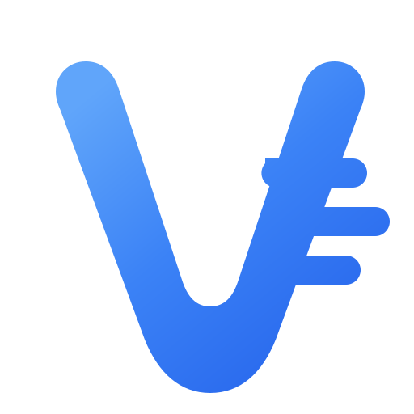

<div align="center">



# vmapi

[](https://golang.org/)
[](https://vuejs.org/)
[](https://www.postgresql.org/)
[](https://redis.io/)
[](https://www.docker.com/)

**マルチプロバイダールーティング・課金・動画生成に対応した AI API ゲートウェイ**

[English](README.md) | [中文](README_CN.md) | 日本語

</div>

## 概要

**vmapi** は、複数プロバイダーの AI クォータを配布・管理するための AI API ゲートウェイです。

ユーザーはプラットフォーム発行の API Key 経由で上流サービスを呼び出し、ゲートウェイが認証・課金・負荷分散・スティッキールーティング・転送を担います。

本リポジトリは **vmapi** フォークで、**Seedance / 動画生成** を第一級機能として追加し、独自ブランドを適用しています。

## 主な機能

- **マルチアカウント管理** — OAuth / API Key 上流アカウント
- **API Key 配布** — ユーザー向け API Key の発行と管理
- **精密課金** — トークン単位の使用量追跡とコスト計算
- **スマートスケジューリング** — インテリジェントなアカウント選択とスティッキーセッション
- **同時実行・レート制限** — ユーザー / アカウント単位の制御
- **内蔵決済** — EasyPay / Alipay / WeChat Pay / Stripe（[設定ガイド](docs/PAYMENT.md)）
- **管理ダッシュボード** — 運用・監視・課金の Web コンソール
- **Composite Groups** — マルチプロバイダーモデルルーティング
- **Seedance 動画ゲートウェイ** — 動画生成 / 状態取得 / アセットアップロード
- **Grok / OpenAI / Claude / Gemini / Antigravity** — マルチプラットフォーム対応

## Seedance 動画サポート

vmapi は独立した `seedance` プラットフォームを追加しています（OpenAI/Grok 配下ではありません）：

| 項目 | 内容 |
|------|------|
| プラットフォーム | `seedance` |
| タスク作成 | `POST /v1/video/generations` |
| タスク照会 | `GET /v1/video/generations/:task_id` |
| アセットアップロード | `POST /v1/assets/uploads` |
| アカウント種別 | API Key のみ |
| デフォルト base_url | `https://api.7tai.cc/v1` |
| 認証 | `Authorization: Bearer <token>` |
| 課金 | タスク受理時に課金（`video`=元/秒、`per_request`=元/回） |

## 技術スタック

| コンポーネント | 技術 |
|----------------|------|
| Backend | Go 1.25.7, Gin, Ent |
| Frontend | Vue 3.4+, Vite 5+, TailwindCSS |
| Database | PostgreSQL 15+ |
| Cache / Queue | Redis 7+ |

## クイックスタート（Docker Compose）

```bash
# クローン
git clone https://github.com/mhgmh/vmapi.git
cd vmapi

# 環境変数を準備
cp deploy/.env.example deploy/.env
# JWT_SECRET / TOTP_ENCRYPTION_KEY / POSTGRES_PASSWORD / 管理者パスワードを編集

# 起動
cd deploy
docker compose up -d

# ログ
docker compose logs -f sub2api
```

セットアップウィザード：

```text
http://YOUR_SERVER_IP:8080
```

### ローカル開発用 Compose

```bash
# リポジトリルート
docker compose -f deploy/docker-compose.local-instance.yml up -d --build
```

## Nginx リバースプロキシ注意

Nginx の前段で vmapi を公開し、スティッキーセッションヘッダー（例: Codex CLI の `session_id`）を使う場合：

```nginx
underscores_in_headers on;
```

Nginx はデフォルトでアンダースコア付きヘッダーを破棄するため、スティッキールーティングが壊れます。

## 開発

```bash
# バックエンド単体テスト
cd backend && go test -tags=unit ./...

# フロントエンド
cd frontend
pnpm install
pnpm run dev
pnpm run build
```

詳細は [DEV_GUIDE.md](DEV_GUIDE.md) を参照。

## プロジェクト構成

```text
vmapi/
├── backend/                  # Go バックエンド
│   ├── cmd/server/           # エントリポイント
│   ├── internal/             # config / model / service / handler / gateway
│   └── resources/
├── frontend/                 # Vue 3 管理画面 + ユーザー画面
│   └── src/
│       ├── api/
│       ├── stores/
│       ├── views/
│       └── components/
├── assets/                   # ブランド素材（logo.svg / logo.png）
├── deploy/                   # Docker / インストールスクリプト
└── docs/                     # 運用ドキュメント
```

## 重要なお知らせ

- 本プロジェクトの利用は上流プロバイダーの利用規約に違反する可能性があります。事前に確認し、リスクは利用者自身が負うものとします。
- 各国・地域の法令を遵守してください。違法利用は禁止です。
- 技術学習およびセルフホスト運用を目的として提供されます。アカウント停止・障害・データ損失等について作者は責任を負いません。
- 本プロジェクトに基づく商業運営の責任は運営者自身にあります。

## ライセンス

本プロジェクトは [GNU Lesser General Public License v3.0](LICENSE)（またはそれ以降）の下でライセンスされます。

上流プロジェクト：[Wei-Shaw/sub2api](https://github.com/Wei-Shaw/sub2api)（LGPL-3.0）。vmapi は独自ブランドと Seedance 動画ゲートウェイ強化を含むフォークです。

---

<div align="center">

**vmapi** · Multi-provider AI API gateway

</div>
